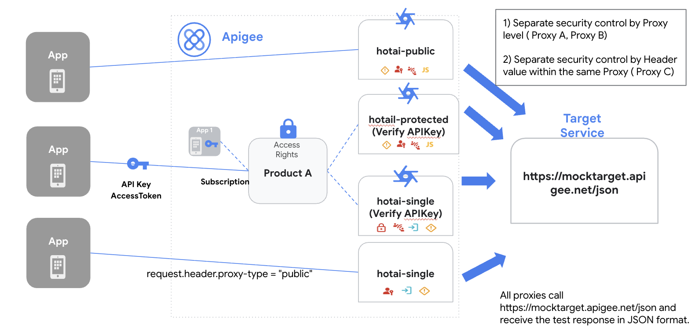

# Hotai Apigee Proxy Sample

This repository contains a sample configuration for deploying API proxies, an API product, a developer, and a client app to Apigee using `apigeecli`.

## Project Overview

The project sets up a secure entry point for APIs with the following components:
*   **API Proxies**:
    *   `hotai-public`: Publicly accessible proxy.
    *   `hotai-single`: Protected proxy.
    *   `hotai-protected`: Protected proxy.
*   **API Product**: `hotai-protected-product` that bundles `hotai-protected` and `hotai-single` proxies with specific operation controls (allowing `GET` methods).
*   **Developer**: `developer@hotai.com`
*   **App**: `hotai-protected-app` subscribed to the product to generate an API key.



## Prerequisites

*   **apigeecli**: The script will attempt to install it if not found.
*   **jq**: Required for parsing JSON output in the scripts.
*   **Google Cloud Project** with Apigee X enabled.
*   **Application Default Credentials (ADC)** configured via `gcloud auth application-default login`.

## Folder Structure

```text
.
├── deploy-proxy-product-app.sh  # Deployment automation script
├── undeploy-all.sh              # Cleanup script
├── env.sh                      # Environment variables configuration
├── product.json                 # API Product operations configuration
├── hotai-public/                # Proxy folder containing 'apiproxy'
├── hotai-single/                # Proxy folder containing 'apiproxy'
├── hotai-protected/             # Proxy folder containing 'apiproxy'
└── images/
    └── hotai-config.png         # Configuration diagram
```

## Setup and Deployment

1.  **Configure Environment Variables**:
    Create an `env.sh` file in the root directory with your Apigee organization and environment details:
    ```bash
    export APIGEE_ORG="your-gcp-project-id"
    export APIGEE_ENV="your-apigee-env-name"
    ```

2.  **Run the Deployment Script**:
    Execute the script to deploy proxies, create the product, developer, and app:
    ```bash
    ./deploy-proxy-product-app.sh
    ```
    This script will:
    *   Deploy the 3 proxies.
    *   Create the `hotai-protected-product` with operations for `hotai-protected` and `hotai-single` (allowing `GET`).
    *   Create the developer and app.
    *   Output the generated **API Key**.

    > [!IMPORTANT]
    > Make sure to copy and save the generated **API Key** from the terminal output. You will need it for testing.

## Test

You can test the deployed proxies using `curl`. Replace `[APIGEE_HOSTNAME]` with your actual Apigee hostname and `APIKEY` with the generated key.

### 1. hotai-protected
Requires API Key:
```bash
curl -H "x-apikey: APIKEY" https://[APIGEE_HOSTNAME]/protected/json
```

### 2. hotai-public
Publicly accessible:
```bash
curl https://[APIGEE_HOSTNAME]/public/json
```

### 3. hotai-single (Protected)
Requires API Key and header:
```bash
curl -H "proxy-type: protected" -H "x-apikey: APIKEY" https://[APIGEE_HOSTNAME]/single/json
```

### 4. hotai-single (Public)
Requires header only:
```bash
curl -H "proxy-type: public" https://[APIGEE_HOSTNAME]/single/json
```

## Analytics

After making API calls to the proxies, you can view the analytics data in two ways:

1.  **Apigee Console**: Navigate to the **Analytics** menu in the Apigee Console to view built-in dashboards.
2.  **Data Studio (formerly Looker Studio)**: You can connect Apigee as a data source in Data Studio to create custom reports and charts with various dimensions and metrics. For detailed instructions on connecting Apigee to Data Studio, refer to the following documentation:
    [Connect to Apigee from Data Studio](https://docs.cloud.google.com/data-studio/connect-to-apigee)

## Cleanup

To remove all resources created by this sample:
```bash
./undeploy-all.sh
```
This script will undeploy and delete the proxies, delete the app, developer, and API product.
